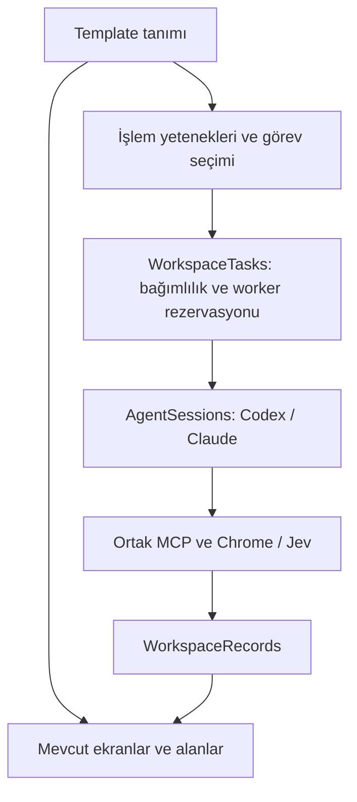

# Template ve ortak çalışma alanı altyapısı

İş arama, ev arama, randevu ve içe aktarılan template’ler aynı kayıt deposunu, kalıcı görev kuyruğunu, worker kaydını, Agent oturumlarını ve tablo araçlarını kullanır. Eski Başvurular, Kaynaklar, Agent, Dosyalar ve profil ekranları korunur.

## Template sözleşmesi

`template-contract.mjs` bütün tanımları sürüm 2’ye normalize eder. Sürüm 1 dosyaları içe aktarılabilir.

- `fields`: kurulum soruları, zorunluluk, metin/sayı/para/tarih/URL/evet-hayır/seçenek türleri.
- `table`: başlık ve typed sütunlar. Agent mevcut UI içinde sütunları ve hücreleri düzenleyebilir.
- `records`: alan eşlemeleri, URL veya anahtar ile tekilleştirme, durum etiketleri ve sınıflandırma geçişleri.
- `workflow`: adım kimliği, yetenek, kaynak/kayıt kapsamı, talimat ve önce tamamlanması gereken adımlar.
- `execution`: kayıtlı yetenek yürütücüsü ve 1–8 worker sınırı.

[İkinci el araba template’i](examples/car-search.loop-template.json) uygulama koduna eklenmeden içe aktarılır. İlan bulma, değerlendirme, mesaj hazırlama ve yetkili gönderim adımlarını; fiyat/kilometre sütunlarını ve kısa liste butonunu tanımlar.

## Tek kayıt ve görev modeli

Web template'lerinde kaynaklar bağımsız tarama turları kullanır. Her kaynak için
ad, kapsam, etkinlik, aralık, işlem modu, son sonuç ve sonraki çalışma zamanı
saklanır. Kaynaklar ekranı bunları eski satır düzeninde gösterir; tek kaynak
başlatılabilir veya kapatılabilir. Kaynak işlem yetkisi profil yetkisini aşamaz.

Bir kaynakta IP engeli, giriş engeli veya süre aşımı diğer kaynakların kuyruğunu
durdurmaz. Engelli kaynak kullanıcı yeniden denediğinde açılır; otomatik yeniden
deneme sözü verilmez. Sağlıklı kaynaklar kendi aralıklarını kullanır. Kaynak
başına görev grafiği ve kayıt bağımlılıkları ortak `workspace_tasks` kuyruğunda
kalır. Worker kapanmadan aynı görev yeniden verilemez. Sonucu belirsiz bir dış
işlem veya sonlandırılamayan sağlayıcı oturumu çalışma alanını durdurmaya devam
eder. Yeni kaynak eklenmesi profil inceleme ve denemesini yeniden gerektirir.

Kaynak agent'ı turu bitirirken yapılandırılmış tarama kapsamını bildirir:
`complete`, `pendingUrls`, `reason`, `evidenceUrl`. Kapsam verilmeden veya
bekleyen adres varken kaynak tamamlanmış sayılamaz. Kalan adresler gerçekten
gözlenen, aynı kaynağa ait bağlantılar olmalıdır. Kısmi tur `partial` olarak
kaydedilir; sağlayıcı kapandıktan sonra aynı görev, kayıtlı adreslerle yeniden
kuyruğa alınır. Alt adımlar kaynak taraması tamamlanana kadar bekler. Tek seferlik
çalıştırma da kısmi turun sonunda durmaz. Devam noktası duraklatma ve yeniden
açılışta korunur; ilerlemeyen aynı adres listesi tekrar tekrar kuyruğa alınamaz.
Bu kontrol agent'ın bütün ilanları doğru değerlendirdiğini tek başına kanıtlamaz;
son sayfaya ulaşıldığı ve eleme gerekçeleri ayrıca denetlenmelidir.

`workspace_records`, eski `jobs` ve `automation_results` tablolarının yerini alır. Kimlik, çalışma alanı, tekilleştirme anahtarı ve kayıt verisi burada saklanır. Template alan eşlemeleri eski şirket/pozisyon alanlarını ortak `fields` görünümüne çevirir. CV ve başvuruya özgü kanıtlar kaybolmadan aynı kaydın uzantı alanlarında kalır.

`workspace_tasks` bekleyen/çalışan/sonucu kaydedilmiş/duraklatılmış/tamamlanmış görevleri saklar. Her worker tek görev alır; aynı kaynak veya kayıt için çakışan rezervasyonlar engellenir. Bağımlılıklar tamamlanmadan sonraki adım başlayamaz. Web görevinde sonuç bildirilmesiyle sağlayıcı sürecinin kapanması farklı aşamalardır; bağımlılıklar kapanış doğrulandıktan sonra açılır.

İş aramanın görev gövdesi de bu tabloda saklanır. Kampanya kayıtları yalnızca görev kimliğine işaret eder; eski kontrol akışı bu ortak kaydı okuyarak devam eder. `workspace_workers`, bütün template’lerin worker kimliklerini ve isimlerini tutar. Konuşmalar worker bazında ayrılır.

## Özel yeteneklerin sınırı

İş arama isteğe bağlı `job-search` uzantısıdır. `app/main.mjs` yalnızca ortak veri deposunu, tarayıcıyı, agent oturumlarını, MCP taşımasını ve kayıtlı uzantıları açar. `app/extensions/job-search` başvuru durumlarını, `jobs.*` yeteneklerini, aday deposunu, MCP araçlarını, başlangıç talimatlarını ve başvuru servislerini sağlar. Kampanya ve başvuru devam koduna yalnızca bu uzantı üzerinden ulaşılır. `app/store.mjs` ve `app/mcp.mjs` mevcut başvuru istemcileri için uyumluluk girişleridir; genel başlangıç bunları yüklemez.

`TemplateRegistry`, yürütücülerin yeteneklerini, varsayılan adımlarını, kayıt durumlarını ve template’lerini kaydeder. Çekirdek `applications` / `browser` ayrımı yapmaz. Yeni bir yürütücü kendi sözleşmesini ve çalışma metotlarını kaydeder; kayıtlı olmayan yürütücü ve yetenekler reddedilir. Workspace oluşturma da `workspaceCreate(templateId, input)` üzerinden ilgili uzantıya gider.

Varsayılan kurulum iş arama uzantısını yükler. `LOOP_EXTENSIONS=''` ile başlatıldığında genel web otomasyonu tek başına açılır; aday, başvuru kampanyası ve soru tabloları oluşturulmaz, başvuru araçları sunulmaz. Daha önce kaydedilmiş bir uzantının verileri korunur; uzantı kapalıyken o workspace’ler listelenmez. Uzantı yeniden açıldığında aynı kimliklerle kullanılabilir.

Ortak Agent ekranı `workspace`, `execution`, `workers[].execution`, `presentation` ve `capabilities` alanlarını okur. Web snapshot’ında yapay `profile` veya `campaign` bulunmaz. Başvuruya özel ekranlar gerçek aday ve kampanya verilerini uzantıdan almaya devam eder.

Genel tarayıcı yürütücüsü template grafiğini kaynak ve kayıt görevlerine dönüştürür. `browser.observe`, `browser.evaluate`, `browser.prepare` ve `browser.act` kayıtlı yeteneklerdir. İki kaynak iki worker’a, sonraki kayıt görevleri boşalan worker’lara dağıtılabilir. `TaskRuns` süre sınırı, kapanış ve kesintiyi; `AgentSessions` sağlayıcı sürecini yönetir.

Başvuru uzantısı `jobs.search`, `jobs.rank`, `jobs.prepare`, `jobs.apply` ve `jobs.verify` yeteneklerini sağlar. CV, uygunluk puanı, kullanıcı yanıtından devam etme, başvuru hedefi ve belirsiz gönderimden toparlanma kuralları `Campaigns` içinde korunur. Bunlar başvuruya ait görev seçme ve doğrulama kurallarıdır; ayrı kayıt deposu, worker kuyruğu veya Agent motoru kurmazlar. Bu uzantının özel görev sırası serbest bir JSON grafiğiyle değiştirilemez; yeni bir başvuru davranışı ilgili yetenek koduna eklenir.

Yeni bir web template’i mevcut yetenekleri kullanıyorsa uygulama kodu gerektirmez. Yeni bir entegrasyon veya tarayıcının sunmadığı işlem yeni bir kayıtlı yetenek gerektirir. Template dosyaları çalıştırılabilir JavaScript içermez.

## Ekran ve yetki

Tek `#agent` ekranı, terminal, ayarlar ve worker bileşeni kullanılır. Listeleme, durum okuma, başlatma, durdurma, yeniden başlatma ve ayarlar `workspaces` / `workspace-*` API’sinden geçer. Eski `snapshot`, `start`, `stop`, `pause` ve paralel `automation-list` / `automation-snapshot` girişleri kaldırılmıştır. Template ekranı ile Agent ekranı aynı snapshot’ı kullanır; `active` sağlayıcı oturumunu, `activeRun` web görevini belirtir. `record-table.js` tablo/hücre/özel durum butonlarını, `template-fields.js` tanımlı soruları çizer. Mevcut başvuru tablosunun CV/puanlama/başvuru kontrolleri yetenek uzantısı olarak kalır.

Agent’ın ortak araçları: `configure_workspace_table`, `get_workspace_records`, `update_workspace_cells`, `transition_workspace_record`. Sınıflandırma geçişi gönderim kanıtını, işlem yetkisini veya onayı değiştirmez. İşlem sonucu ayrıca gösterilir. Gönderim hâlâ kayıtlı yetki, güncel taslak, tekilleştirme ve sonuç doğrulamasından geçer.

## Veri geçişi ve doğrulama

Agent ayarları, tarayıcı seçimi, Chrome profili ve tablo şeması yalnızca `workspaces` içinde saklanır. CV, öğrenilen bilgiler, başvuru politikası ve puan eşiği güncellemeleri ortak alanları `candidates` kaydına geri yazmaz. Açılış geçişi eski kopyaları temizler; mevcut workspace ayarlarını korur.

Worker ekleme, başlatma, durdurma, yeniden başlatma ve kaldırma çağrıları `Workspaces` servisinden geçer. Üyelik kontrolü, yeniden başlatma kilidi, sağlayıcı kapandıktan sonra konuşmayı temizleme ve terminal çıktısını kaldırma ortaktır. Başvuru uzantısı yeniden başlatma öncesinde CV ve hedefi doğrular; kesilen gönderimin doğrulama görevi olarak devam etmesini sağlar. Web uzantısı kendi kalıcı görevlerini aynı worker arayüzüne bağlar.

Arayüz bütün template’lerde aynı `renameWorkspace`, `deleteWorkspace`, `documents`, `pickDocument`, `readDocument` ve `openDocument` API’lerini kullanır. CV seçimi `pickDocument(id, {purpose:'cv'})` üzerinden başvuru uzantısına iletilir. Belgelerin dizin sınırları ve metin önizleme kontrolleri ortaktır; eski `automationRename`, `automationDelete` ve paralel belge API’leri kaldırılmıştır.

Şema 5, eski kayıtları JSON içeriğini değiştirmeden ortak tabloya taşır; soru ve ilan eşleme ilişkilerini yeni tabloya bağlar. Eski worker isimleri, konuşma kimlikleri ve görev gövdeleri taşınır. Taşıma tamamlanınca `agent_workers`, `agent_conversations` ve `conversation_launch_settings` kaldırılır; yeni açılışlarda yeniden oluşturulmaz. Kişisel başvuru template’lerinin kimliği yeniden açılışta korunur. Yeniden deneme bilgileri ortak worker kuyruğunda saklanır; kampanya kayıtlarına kopyalanmaz. Ortak kuyruğa taşınmış görevler her açılışta yeniden yazılmaz. Geçiş tekrarlanabilir; açılış öncesinde mevcut yedek mekanizması çalışır. Tarayıcı giriş dizinleri taşınmaz. Yedek geri yükleme görevleri durdurur, konuşma kimliklerini ve işlem onaylarını temizler.

`generic-workspaces.test.mjs` yeni template tanımını, iki worker ile adım bağımlılıklarını, kapanış rezervasyonunu, gönderim yetkisini ve şema 4 geçişini sınar. Mevcut iş arama testleri başvuru devam kurallarını doğrular. Electron testleri gerçek içe aktarma, alan türleri, kısa liste butonu/filtre, aynı Agent ekranında iki worker, özgün iş arama ekranı, yedek geri yükleme ve yerel form gönderimini kapsar. Sağlayıcı kararları testlerde kontrollüdür; canlı portallarda başarı garantisi çıkarılmaz.

`extensions.test.mjs` üçüncü bir yürütücünün kaydını, iş arama kapatılıp yeniden açıldığında veri korunmasını ve genel başlangıcın başvuru modüllerine statik bağımlılığı olmadığını sınar. `scripts/smoke-web-only.mjs`, iş arama uzantısı tamamen kapalıyken Electron’da workspace oluşturur; gerçek Chrome ile deneme, sayfalama ve iki ilanı kaydetme akışını çalıştırır. SQLite’ta aday/başvuru tablolarının oluşmadığını ve MCP’de başvuru araçlarının sunulmadığını doğrular. Bu testte sağlayıcı yanıtları kontrollüdür; tarayıcı, IPC, MCP ve veri deposu gerçektir.

Eski şema ve sürüm 1 template dosyalarını okumak için gereken dönüşümler korunur. CV, puanlama ve başvuru devam kuralları yetenek uzantıları olarak korunur.
